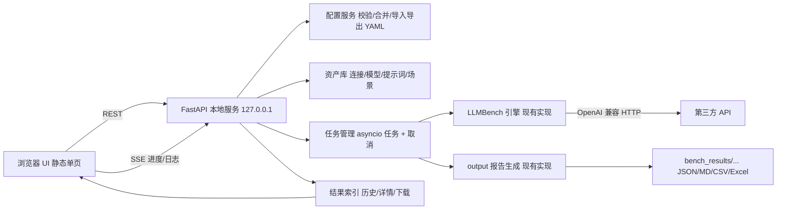
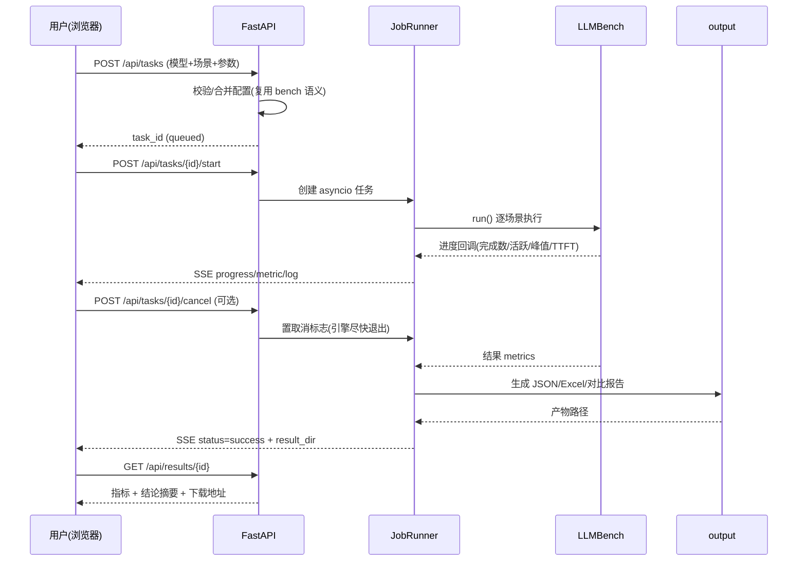

# llmeter 压测平台 · 开发文档

> 状态：设计定稿，待开发
> 编写日期：2026-09-10
> 适用对象：开发者 / 维护者
> 关联文档：[功能说明](功能说明.md)、[指标手册](metrics.md)、[开环 vs 闭环压测](open-vs-closed-loop.md)、[CHANGELOG](CHANGELOG.md)

---

## 1. 背景与目标

### 1.1 现状

llmeter 目前是命令行工具，两个入口：

- `chat`：单次压测（`bench.py chat -b … -k … -m … -c … -n …`）；
- `scenarios`：多场景 / 多模型对比压测（`bench.py scenarios -f config/xxx.yaml`）。

配置为 YAML，分四层，优先级 `场景 > 模型 > defaults > 顶层公共 > 内置默认`；结果落在 `bench_results/YYYY-MM-DD/`（JSON / Markdown / CSV / Excel）。

### 1.2 痛点

| # | 痛点 | 说明 |
|---|------|------|
| 1 | 换模型/换密钥成本高 | 要改 YAML 或拼长命令行，参数多且容易漏 |
| 2 | 场景矩阵靠手写 YAML | 输入梯度、输出梯度、业务场景、QPS 阶梯都要手工维护，层级易错 |
| 3 | 密钥分散 | 多份 YAML 里各有一份 key，容易混淆、误提交 |
| 4 | 结果要靠翻目录 | 跑完得自己去 `bench_results` 找文件 |
| 5 | 非技术同事无法使用 | 命令行 + YAML 门槛过高 |

### 1.3 目标

1. 把「连接/密钥/模型/场景/参数」变成界面上的可增删改对象，一键复用；
2. 点几下就能发起单次或多场景压测，实时看进度，随时中止；
3. 历史结果可在界面浏览、下载（复用现有 JSON/Excel 产物）；
4. **引擎与指标口径零改动**：UI 与 CLI 跑同配置必须得到一致结果；
5. 对扩展开放：API-first，后续可加图表、任务队列、多人协作，而不推翻现有结构。

### 1.4 非目标（本阶段不做）

- 不做多用户/权限/计费；不部署到公网（仅监听 `127.0.0.1`）；
- 不重写压测引擎、不调整指标计算与报告口径；
- 不做前端工程化构建（无 Node 依赖），暂不追求视觉美化；
- 不做分布式压测（多机发压）、不做定时调度（留到 M3 之后）。

---

## 2. 已确认的技术决策

| 决策项 | 结论 | 备注 |
|--------|------|------|
| 产品形态 | 本地 Web 应用 | 浏览器访问 `http://127.0.0.1:<port>`，服务只监听本机 |
| 任务执行 | Web 服务进程内用 asyncio 直接跑 | 复用现有 `LLMBench`（本身就是 async） |
| 后端 | Python + FastAPI + uvicorn | 复用现有 Python 依赖，新增依赖仅 fastapi/uvicorn |
| 前端 | 静态单页（原生 JS + fetch + EventSource） | 无 Node 构建；后续可平滑替换为 Vue/ECharts |
| 存储 | SQLite（`app/data/llmeter.db`） + 现有文件产物 | 配置入库，结果仍写 `bench_results/` |
| 密钥 | 两种模式都要支持，用户自选 | `env`：存 `${VAR}` 引用；`local`：本机加密存储 |
| 扩展性 | API-first、分层解耦 | 前端可替换、可加队列/多用户，不影响引擎 |

---

## 3. 总体架构



分层职责：

| 层 | 职责 | 不做什么 |
|----|------|----------|
| 前端静态页 | 表单/表格编辑、进度展示、结果浏览 | 不直接读文件、不拼命令行 |
| API 路由层 | 参数校验、鉴权（本机无）、调用 service | 不写业务逻辑 |
| Service 层 | 配置合并、资产 CRUD、任务调度、密钥处理 | 不改指标口径 |
| 引擎/输出层（现有） | 发压、聚合指标、生成报告 | 不做 UI 相关判断 |

---

## 4. 目录结构

```
llmeter/
├── bench.py                    # 现有 CLI（保留）
├── src/
│   ├── engine.py               # 现有引擎（少量适配：进度回调/取消）
│   └── output.py               # 现有报告（直接复用）
├── config/                     # 配置示例（真实配置不进 git）
│   ├── config.yaml.example
│   ├── scenarios.yaml.example
│   ├── models-comparison.yaml.example
│   ├── qps-openloop.yaml.example
│   └── concurrency-long-input.yaml
├── prompts/                    # 提示词资产
├── docs/                       # 文档（含本文档）
├── bench_results/              # 结果产物（git 忽略）
└── app/                        # 新增：压测平台
    ├── main.py                 # FastAPI 实例 + 静态托管 + 启动入口
    ├── settings.py             # 端口、数据目录、默认值
    ├── db.py                   # SQLite 连接与建表
    ├── routers/
    │   ├── connections.py
    │   ├── models.py
    │   ├── prompts.py
    │   ├── scenarios.py
    │   ├── tasks.py
    │   └── results.py
    ├── services/
    │   ├── catalog.py          # 资产 CRUD
    │   ├── config_service.py   # 校验/合并/导入导出 YAML
    │   ├── key_store.py        # env 引用 + 本机加密
    │   ├── job_runner.py       # 任务生命周期、进度广播、取消
    │   └── runner_bridge.py    # 调用现有 bench/engine/output 的桥接层
    ├── static/
    │   ├── index.html
    │   ├── css/app.css
    │   └── js/{api.js,state.js,app.js,views/*.js}
    └── data/                   # llmeter.db、加密密钥材料（git 忽略）
```

启动：`python -m app.main`（内部 `uvicorn.run`，默认端口 8765，可用 `--port` 覆盖）。

---

## 5. 数据模型

SQLite，单文件 `app/data/llmeter.db`。所有表均带 `created_at` / `updated_at`。

### 5.1 connections（连接）

| 字段 | 类型 | 说明 |
|------|------|------|
| id | INTEGER PK | |
| name | TEXT | 显示名，如「omnix 官方」 |
| base_url | TEXT | API 基础地址 |
| key_mode | TEXT | `env` / `local` |
| key_ref | TEXT | env 模式存变量名（如 `OMNIX_API_KEY`）；local 模式存密文 |
| note | TEXT | 备注 |

### 5.2 models（模型）

| 字段 | 类型 | 说明 |
|------|------|------|
| id | INTEGER PK | |
| label | TEXT | 报告里的显示名（对应 `name`） |
| model | TEXT | 请求里的模型 id |
| connection_id | INTEGER FK | 为空表示用任务级公共连接 |
| extra_params | TEXT(JSON) | 推理开关等（thinking / reasoning_effort） |
| note | TEXT | |

### 5.3 prompts（提示词）

| 字段 | 类型 | 说明 |
|------|------|------|
| id | INTEGER PK | |
| name | TEXT | 名称 |
| content | TEXT | 正文（大文件也可只存路径） |
| file_path | TEXT | 落盘路径（`prompts/` 下） |
| tags | TEXT | 逗号分隔：输入-短 / 业务-翻译 … |
| token_estimate | INTEGER | 保存时估算（复用 `count_tokens`） |

### 5.4 scenarios（场景模板）

| 字段 | 类型 | 说明 |
|------|------|------|
| id | INTEGER PK | |
| name | TEXT | 场景名（前缀决定分组，如 `输入-短`） |
| group | TEXT | 分组（输入/输出/业务/QPS/并发） |
| prompt_id | INTEGER FK | 可空 |
| overrides | TEXT(JSON) | 只存覆盖项（concurrency/requests/qps/max_tokens/...） |
| sort | INTEGER | 排序 |

### 5.5 task_templates（任务模板）

| 字段 | 类型 | 说明 |
|------|------|------|
| id / name | | 模板名 |
| config_json | TEXT | 完整任务快照（模型+场景+默认参数+输出选项） |

### 5.6 tasks（任务）

| 字段 | 类型 | 说明 |
|------|------|------|
| id | INTEGER PK | |
| name | TEXT | 任务名（默认自动生成：日期+模型+场景数） |
| mode | TEXT | `chat` / `scenarios` |
| config_snapshot | TEXT(JSON) | 运行时的完整配置（可复现） |
| status | TEXT | `queued` / `running` / `success` / `failed` / `canceled` |
| total / success / fail | INTEGER | 完成后快照 |
| result_dir | TEXT | 产物目录 |
| log_path | TEXT | 运行日志 |
| error | TEXT | 失败原因 |
| created_at / started_at / finished_at | TEXT | 时间戳 |

### 5.7 与现有 YAML 的字段映射

| YAML/CLI | 平台对象 |
|----------|----------|
| `base_url` / `api_key` | connections |
| `model` / `models[]` | models |
| `prompt` / `prompt_file` | prompts |
| `scenarios[]` | scenarios |
| `defaults` / 顶层公共参数 | 任务的「默认参数」面板 |
| `output_dir`、`--excel`、`--excel-charts` | 任务的「输出」选项 |

字段全集与 `bench.py add_common_args`、`build_engine_config` 保持一致，UI 不新增私有语义。

---

## 6. 后端 API 设计

统一前缀 `/api`，返回 JSON；错误用 HTTP 状态码 + `{ "detail": "..." }`。

### 6.1 资产

| 方法 & 路径 | 说明 |
|-------------|------|
| `GET/POST /api/connections`；`PUT/DELETE /api/connections/{id}` | 连接增删改查 |
| `POST /api/connections/{id}/test` | 连通性测试：按连接发 1 个最小请求 |
| `GET/POST /api/models`；`PUT/DELETE /api/models/{id}` | 模型增删改查 |
| `GET/POST /api/prompts`；`PUT/DELETE /api/prompts/{id}` | 提示词增删改查 |
| `GET /api/prompts/{id}/preview` | 返回前 N 字符 + token 估算 |
| `GET/POST /api/scenarios`；`PUT/DELETE /api/scenarios/{id}` | 场景增删改查 |
| `GET/PUT /api/defaults` | 全局默认参数（单条记录） |
| `POST /api/import-yaml` | 上传 YAML → 解析为连接/模型/场景（返回预览，确认后落库） |
| `GET /api/export-yaml?task_id=` | 导出当前配置为 YAML 文本（兼容 CLI） |

### 6.2 任务

| 方法 & 路径 | 说明 |
|-------------|------|
| `POST /api/tasks` | 创建任务（校验配置，落库，状态 `queued`），返回 `{task_id}` |
| `POST /api/tasks/{id}/start` | 启动（异步），返回 202 |
| `POST /api/tasks/{id}/cancel` | 请求中止 |
| `GET /api/tasks?status=&limit=` | 任务列表 |
| `GET /api/tasks/{id}` | 任务详情（状态、进度快照、配置） |
| `GET /api/tasks/{id}/events` | SSE：进度/指标/日志/结束事件 |

创建任务请求示例：

```json
{
  "name": "glm-5.2 输入梯度",
  "mode": "scenarios",
  "model_ids": [1, 2],
  "scenario_ids": [10, 11, 12],
  "defaults": {
    "concurrency": 10, "requests": 200, "stream": true,
    "warmup": 2, "retries": 0, "track_cache": true
  },
  "options": { "excel": true, "excel_charts": false }
}
```

SSE 事件协议：

```
event: progress   data: {"completed":120,"total":600,"active":10,"peak":12,"failed":0,"ttft_avg":0.42,"scene":"输入-短"}
event: metric     data: {"qps":8.3,"success_rate":100.0,"cache_hit_rate":37.5}
event: log        data: {"line":"⏳ 120/600 | 活跃流 10 | 峰值 12"}
event: status     data: {"status":"success","result_dir":"bench_results/2026-09-10/..."}
event: error      data: {"message":"连接超时"}
```

### 6.3 结果

| 方法 & 路径 | 说明 |
|-------------|------|
| `GET /api/results?date=&model=` | 历史结果列表（读 tasks + 扫描产物目录） |
| `GET /api/results/{task_id}` | 详情：summary（现有 metrics）+ 结论摘要文本 |
| `GET /api/results/{task_id}/files` | 产物清单 |
| `GET /api/results/{task_id}/download?kind=xlsx\|json\|md\|csv` | 文件下载 |
| `POST /api/results/{task_id}/rerun` | 用同一 config_snapshot 再跑一次 |

---

## 7. 前端设计（静态单页）

### 7.1 约束

- 单个 `index.html` + 原生 JS 模块，无构建、无 Node；
- 状态放内存（`state.js`），刷新后从 API 重新拉取；
- 表格/表单用原生 DOM 渲染，样式集中在一个 `app.css`；
- 后续要换 Vue/ECharts 时，只替换 `static/`，API 不变。

### 7.2 页面结构

顶部导航（5 个页签）+ 内容区：`压测` / `运行中` / `资产库` / `结果` / `设置`。

### 7.3 压测（新建任务）——控件级

三栏：

左栏「模型与连接」

- 模型多选卡片：显示名、model、连接名、推理开关摘要、勾选框；
- `+ 添加模型`：弹窗选择连接（下拉）或新建连接、填 model、`extra_params` JSON 编辑框；
- 每张卡片：编辑 / 复制 / 删除；
- 顶部提示：`已选 2 个模型 × 3 个场景 = 6 组压测`。

中栏「场景清单」

- 表格列：勾选、场景名、提示词（下拉/粘贴）、并发、请求数、QPS、时长、max_tokens、timeout、操作；
- 行内编辑，`QPS` 填写后自动禁用该行 `并发` 并提示「开环模式：并发不再限流」；
- 底部：`+ 添加场景`、`从提示词库生成`、`从 YAML 导入`、上下移动、删除；
- 空态引导：给出「输入梯度 / 输出梯度 / QPS 阶梯」三个一键模板。

右栏「默认参数 + 运行」

- 基础：stream、warmup、retries、max_tokens、timeout；
- 高级（折叠）：temperature、read_timeout、unique_prefix、http2、track_cache、verbose、输出目录；
- 输出：`生成 Excel`、`Excel 附带柱状图`（默认关）；
- 主按钮：`▶ 运行`；次按钮：`保存为模板`、`导出 YAML`。

### 7.4 运行中

- 顶部：任务名 + 状态徽标（排队/运行中/成功/失败/已中止）；
- 进度条：`已完成 / 总数`，当前场景名；
- 指标卡：成功率、QPS、TTFT 均值、活跃/积压、已耗时；
- 实时日志区（自动滚到底部，可暂停）；
- `■ 中止`：二次确认后调 cancel。

### 7.5 资产库（连接 / 模型 / 提示词）

- 连接卡片：名称、Base URL、密钥模式徽标（环境变量 / 本机加密，值永远显示为 `sk-****`）、备注；
  操作：编辑 / 删除 / `测试连接`（显示成功耗时或错误码与原因）；
- 模型卡片：显示名、model、所属连接、extra_params 摘要、「被 N 个模板引用」；
- 提示词表格：名称、标签、token 估算、更新时间；右侧预览抽屉；`+ 新建提示词`。

### 7.6 结果

- 列表：日期分组，列 = 任务名、模型、场景数、状态、成功率、平均 QPS、耗时；
- 详情页：
  - 左：结论摘要（复用 Excel 顶部那套要点文案）；
  - 中：指标表（复用现有 metrics 字段）+ 后续图表（M2 用 ECharts，本地静态文件）；
  - 右：下载 `Excel / JSON / MD / CSV`、`重新运行`。

### 7.7 设置

- 默认输出目录、是否默认生成 Excel、默认 stream/warmup/retries；
- 服务端口显示、数据目录路径、`打开结果目录`（本机路径展示）；
- 密钥策略说明与「默认密钥模式」选择。

---

## 8. 核心流程



关键规则：

1. **任务快照**：创建任务时把配置整体存 `config_snapshot`，之后改资产不影响历史复现；
2. **单实例单任务**：M1 只允许同时跑 1 个任务（避免客户端自身互相干扰指标），后续再做队列；
3. **取消**：置标志 → 引擎在当前请求边界退出 → 已完成结果仍落盘并标记 `canceled`；
4. **口径一致**：UI 与 CLI 都走同一 `runner_bridge`，输出文件结构一致。

---

## 9. 与现有代码的衔接

### 9.1 需要做的适配（保持行为不变）

| 文件 | 适配内容 |
|------|----------|
| `bench.py` | 把 `cmd_chat` / `cmd_scenarios` 中"配置组装 → 调用引擎 → 出报告"抽成可复用函数；CLI 参数解析保留并调用同一函数 |
| `src/engine.py` | `LLMBench` 增加可选 `on_progress` 回调与 `request_cancel()`；`_monitor()` 的输出改为"回调 + 可选 print"，CLI 行为不变 |
| `src/output.py` | 无需改动，`print_report/save_results/save_excel/...` 直接调用；可选在 `save_results` 的 meta 中带 `task_id` |
| `app/services/config_service.py` | 复刻 `_expand_env`（`${VAR}` 展开）与合并优先级，保证 YAML 导入/导出口径一致 |

### 9.2 明确不动的部分

- 指标计算（`aggregate`）、失败三分类、多分位、TPOT/TTFT 口径；
- 开环/闭环调度逻辑、连接池策略、重试策略；
- Excel/对比报告的内容与结论摘要规则；
- 现有 CLI 的所有参数与默认值。

---

## 10. 关键实现细节

### 10.1 任务执行

- `JobRunner` 内部维护 `dict[task_id] -> asyncio.Task` 与 `dict[task_id] -> asyncio.Queue`（SSE 订阅）；
- 引擎进度回调把事件写入队列，SSE 路由从队列读取并下发；无订阅者时丢弃，不阻塞引擎；
- 单任务串行执行场景；多任务在 M1 用互斥锁限制为 1（设置项可放开）。

### 10.2 进度与实时指标

- 复用现有 `_monitor` 的每秒采样（完成数、活跃流、峰值、TTFT 均值、失败数）；
- 额外把当前场景名、目标 QPS/并发写进事件，便于 UI 展示；
- SSE 每 15 秒发一次心跳注释，避免浏览器断连。

### 10.3 密钥处理

| 模式 | 存储 | 使用 |
|------|------|------|
| `env` | 只存变量名（如 `OMNIX_API_KEY`） | 运行时 `os.path.expandvars("${OMNIX_API_KEY}")` |
| `local` | Windows DPAPI 加密后的密文（`CryptProtectData`），存 `connections.key_ref` | 运行时按当前用户解密，仅存在内存 |

- 接口返回值一律脱敏（`sk-****abcd`）；日志与错误信息中过滤 key；
- 加密密钥材料放 `app/data/`，该目录加入 `.gitignore`。

### 10.4 结果与文件

- 产物仍写 `bench_results/YYYY-MM-DD/`，与 CLI 共用目录，历史可混读；
- `tasks.result_dir` 记录目录，`/api/results` 以 DB 为主、目录扫描兜底（兼容命令行跑出的历史文件）。

### 10.5 静态前端托管

- `app.mount("/", StaticFiles(directory="app/static", html=True))`，API 走 `/api/*`；
- 无构建步骤：修改 JS/CSS 刷新浏览器即可生效；
- 前端所有请求带 `fetch` 封装，统一处理错误提示。

---

## 11. 错误处理与边界

| 场景 | 处理 |
|------|------|
| 必填缺失（base_url/model） | 前端即时校验 + 后端 400，提示缺哪一项 |
| 连通性失败（401/404/超时） | `测试连接` 返回可读原因（状态码 + 服务端消息片段） |
| 场景为空 / 全部未勾选 | 拒绝启动并提示 |
| 端口被占用 | 启动失败给出提示，支持 `--port` 换端口 |
| 运行中关闭浏览器 | 任务继续跑完并落盘；重开页面从历史进入 |
| 重复点击运行 | 前端置灰 + 后端单任务锁，返回 409 |
| 磁盘/权限错误 | 捕获异常，任务置 `failed` 并写 `error` |
| 引擎异常 | 记录堆栈到 `log_path`，SSE 推 `error` 后置 `failed` |

---

## 12. 里程碑与验收标准

### M1 · 跑通最小闭环

范围：静态页 + 连接/模型 CRUD + 单模型 `chat` 压测 + 实时进度 + 取消 + 结果下载（JSON/Excel）。

验收（DoD）：

1. `python -m app.main` 启动后浏览器可用；
2. 界面新建连接（env 与 local 两种密钥模式各验证一次）与模型；
3. 发起一次 10 请求的压测，进度条与日志实时更新；
4. 点中止能停止，任务状态为 `canceled` 且已产生的文件仍可用；
5. 结果页可下载 JSON 与 Excel；
6. **口径回归**：同参数下 UI 跑出的 summary 与 CLI 跑出的 summary 各数值字段一致（允许时间类字段差异）。

### M2 · 场景与批量

范围：提示词库、场景清单、多模型勾选、`scenarios` 模式、Excel/对比报告、历史结果列表、模板与 YAML 导入导出。

验收（DoD）：

1. 界面配置 3 场景 × 2 模型可跑通并生成对比报告与 Excel；
2. 导出的 YAML 能被 `python bench.py scenarios -f` 直接运行；
3. 导入 `config/models-comparison.yaml.example` 能正确解析出连接/模型/场景；
4. 历史列表能看到 CLI 与 UI 两种来源的结果。

### M3 · 体验与扩展

范围：结果页图表（ECharts 本地静态）、参数扫描向导（QPS/并发梯度一键跑）、任务队列（并发数可配）、定时任务与 SLA 告警（可选）。

验收（DoD）：图表数据与 Excel 数值一致；扫描向导能自动生成并对比多个档位的报告；多任务排队不互相干扰指标。

---

## 13. 测试计划

1. **口径一致性回归（最重要）**：固定一组配置，分别用 CLI 与 UI 跑，比较 summary 的全部数值字段；不一致即阻断发布；
2. 资产 CRUD 单测：含 YAML 导入导出往返（导出→导入→导出应稳定）；
3. 密钥测试：env 模式不落明文；local 模式密文不可读、解密后可用、接口只回脱敏值；
4. 任务生命周期测试：排队/运行/取消/失败/成功五种状态转换；
5. SSE 稳定性：长任务（>10 分钟）下不断连、不丢最终状态；
6. 边界测试：空场景、无勾选、端口占用、请求超时、401/404。

---

## 14. 风险与待定项

| 风险/待定 | 影响 | 应对 |
|-----------|------|------|
| 引擎 `gc.disable()` 在长任务中与 Web 服务共存 | 内存压力 | M1 实测；必要时把压测放到子进程（接口不变） |
| 单进程同时跑 Web + 压测，压测占满事件循环 | UI 卡顿 | 大量 I/O 场景影响小；必要时压测移到独立进程 |
| 大 prompt（1.4MB）在界面上编辑 | 前端卡顿 | 预览截断，编辑走文件上传/路径引用 |
| DPAPI 仅 Windows 可用 | 跨平台限制 | 非 Windows 降级为本地密钥文件（0600 权限）+ 提示 |
| 真实密钥历史泄漏 | 安全 | 提交前扫描；`.gitignore` 全量忽略 `config/*.yaml`；示例一律 `.example` |

---

## 15. 附：提交与文件约定

- 真实配置（`config/*.yaml`）不进 git，示例统一用 `*.yaml.example`；
- 结果目录 `bench_results/`、`__pycache__/`、`app/data/` 不进 git；
- 新增依赖写入 `requirements.txt`（`fastapi`、`uvicorn[standard]`）；
- 文档随功能同步更新：本文件 + `CHANGELOG.md`。
